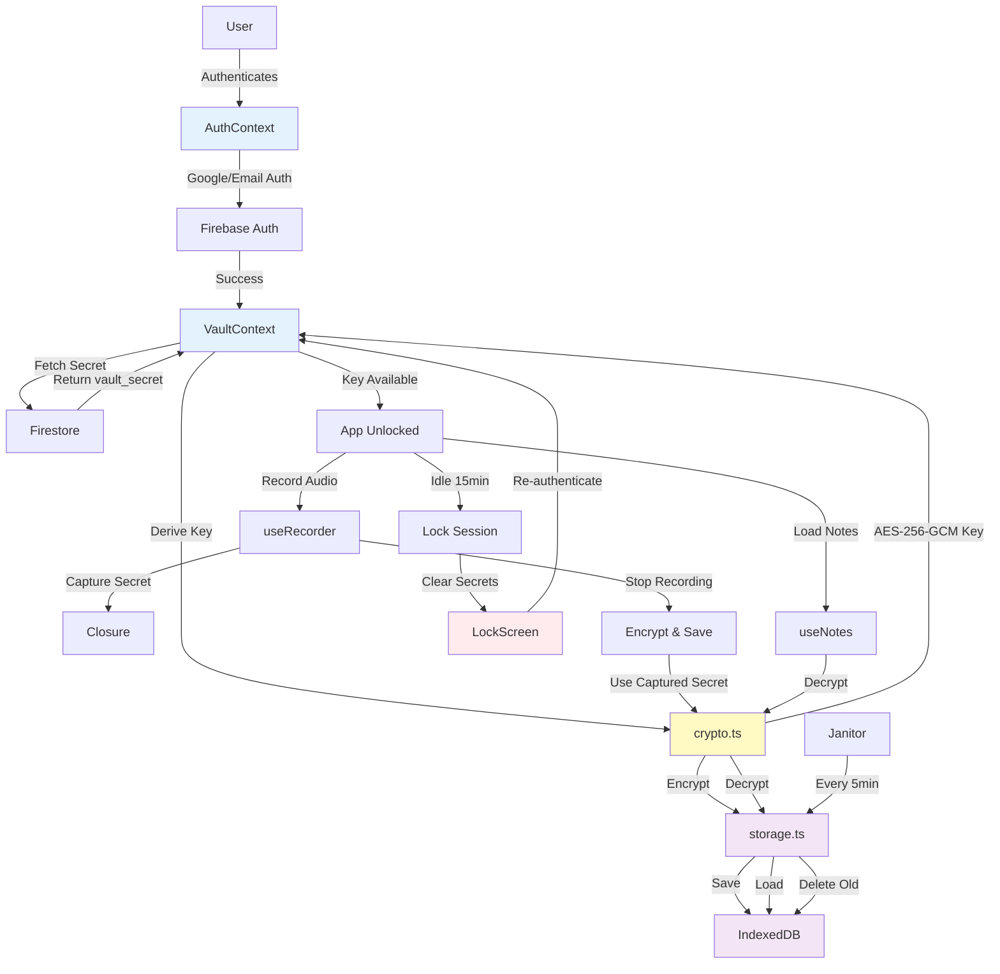

# Design Document - AppV2 Vault Secret Architecture Update

## Overview

This design document outlines the architectural changes to migrate from a PIN-based zero-knowledge encryption system to a Firestore-based vault secret approach. The new architecture maintains HIPAA-compliant security while eliminating UX friction from PIN entry. The vault secret is stored securely in Firestore with immutable security rules, fetched during authentication, and held in memory during active sessions. Idle timeout triggers a lock screen that requires re-authentication to unlock.

**Note:** For comprehensive implementation details and code examples, refer to `/Users/treyhuffine/hipaa-notetaker/prd2.md`.

## Steering Document Alignment

### Technical Standards (tech.md)

No steering documents exist yet, but this design follows established patterns:
- **Next.js Pages Router**: All routes in `src/pages/` directory
- **TypeScript**: Strict typing throughout
- **Tailwind CSS + Shadcn UI**: Component styling
- **Firebase**: Authentication and Firestore for cloud services
- **Web Crypto API**: Browser-native cryptography (FIPS 140-2 compliant)
- **IndexedDB via idb-keyval**: Client-side encrypted storage
- **React Context**: State management pattern

### Project Structure (structure.md)

The implementation follows the existing project structure:
```
src/
├── components/       # UI components (Shadcn + custom)
│   └── ui/          # Shadcn primitives
├── context/         # React Context providers
├── hooks/           # Custom React hooks
├── lib/             # Utilities and services
├── pages/           # Next.js pages (Pages Router)
│   └── api/         # API routes
├── styles/          # Global styles
└── types/           # TypeScript type definitions
```

## Code Reuse Analysis

### Existing Components to Leverage

- **AuthContext** (src/context/AuthContext.tsx): Will be **modified** to remove custom claims logic and integrate Firestore vault secret fetching
- **VaultContext** (src/context/VaultContext.tsx): Will be **replaced** with simplified version removing PIN logic
- **Firebase Client** (src/lib/firebase-client.ts): Will be **extended** to export Firestore client
- **Constants** (src/lib/constants.ts): Will be **updated** to add VAULT_SECRET_LENGTH and remove PIN_CONFIG
- **Crypto Utilities** (src/lib/crypto.ts): Will be **modified** to remove PIN parameter from deriveVaultKey
- **Storage Utilities** (src/lib/storage.ts): Will be **modified** to change encryption interface (no PIN)
- **useRecorder Hook** (src/hooks/useRecorder.ts): Will be **modified** to implement closure pattern for vault secret capture
- **useNotes Hook** (src/hooks/useNotes.ts): Will remain **mostly unchanged** but interface updated
- **Shadcn UI Components**: Will **reuse** existing Button, Card, Alert, Dialog, Input components
- **Layout Component** (src/components/Layout.tsx): Will **reuse** for consistent page structure

### Components to Remove

- **PINOverlay.tsx** (src/components/PINOverlay.tsx): Delete entirely
- **PINSetup.tsx** (src/components/PINSetup.tsx): Delete entirely
- **/pages/api/auth/init.ts** (src/pages/api/auth/init.ts): Delete custom claims endpoint

### Integration Points

- **Firebase Authentication**: Already integrated via firebase-client.ts, will continue using Google OAuth and email/password
- **Firestore**: New integration for vault secret storage with security rules
- **IndexedDB**: Already integrated via idb-keyval, no changes to storage mechanism
- **Groq API**: No changes to /api/scribe endpoint
- **Web Crypto API**: Already integrated, slight modification to key derivation (remove PIN parameter)

## Architecture

The new architecture simplifies the authentication and encryption flow by removing PIN management and using Firestore as the secure vault secret store.

### Modular Design Principles

- **Single File Responsibility**: Each file handles one specific concern
  - `vault.ts`: Vault secret generation and Firestore CRUD operations
  - `firestore.ts`: Firestore client initialization
  - `crypto.ts`: Encryption/decryption operations (no PIN logic)
  - `storage.ts`: IndexedDB operations
  - `VaultContext.tsx`: Session management and idle timeout (no PIN logic)
  - `AuthContext.tsx`: Firebase authentication (no custom claims logic)
  - `LockScreen.tsx`: Lock screen UI component
- **Component Isolation**: UI components are small and focused
- **Service Layer Separation**: Clear separation between data (Firestore), encryption (crypto), and presentation (React components)
- **Utility Modularity**: Each utility module has a single purpose

### Architecture Diagram



## Components and Interfaces

### Component 1: Firestore Client (src/lib/firestore.ts)

- **Purpose:** Initialize and export Firestore client for vault secret operations
- **Interfaces:**
  ```typescript
  export const db: Firestore;
  ```
- **Dependencies:** Firebase app from firebase-client.ts
- **Reuses:** Existing Firebase configuration

### Component 2: Vault Secret Utilities (src/lib/vault.ts)

- **Purpose:** Generate cryptographically secure vault secrets and manage Firestore CRUD operations
- **Interfaces:**
  ```typescript
  export async function getOrCreateVaultSecret(uid: string): Promise<string>;
  ```
- **Dependencies:** Firestore client, constants (VAULT_SECRET_LENGTH)
- **Reuses:** None (new module)
- **Details:**
  - Generates 64-character URL-safe Base64 strings using `crypto.getRandomValues()`
  - Fetches existing vault secret or creates new one on first login
  - Firestore document path: `/users/{uid}/vault/secret`
  - Document structure: `{ vaultSecret: string, createdAt: timestamp }`

### Component 3: Updated Crypto Utilities (src/lib/crypto.ts)

- **Purpose:** Encryption/decryption operations using AES-256-GCM
- **Interfaces:**
  ```typescript
  export async function deriveVaultKey(vaultSecret: string): Promise<CryptoKey>;
  export async function encryptData(key: CryptoKey, data: string): Promise<{ iv: string; ciphertext: string }>;
  export async function decryptData(key: CryptoKey, iv: string, ciphertext: string): Promise<string>;
  ```
- **Dependencies:** constants (CRYPTO_CONFIG)
- **Reuses:** Existing encryptData, decryptData functions (unchanged)
- **Changes:**
  - Remove `pin` parameter from `deriveVaultKey()`
  - Remove `isValidPIN()` function
  - Use vault secret as both key material and salt for PBKDF2
  - Reduce PBKDF2 iterations from 250,000 to 100,000 (PIN no longer user-entered, so less vulnerable to brute force)

### Component 4: Updated Storage Utilities (src/lib/storage.ts)

- **Purpose:** IndexedDB operations for encrypted notes and janitor cleanup
- **Interfaces:**
  ```typescript
  export async function saveEncryptedNote(note: EncryptedNote): Promise<void>;
  export async function loadAllNotes(key: CryptoKey): Promise<DecryptedNote[]>;
  export async function deleteNote(noteId: string): Promise<void>;
  export async function purgeAllData(): Promise<void>;
  export async function runJanitor(): Promise<number>;
  ```
- **Dependencies:** idb-keyval, crypto.ts, constants
- **Reuses:** Existing functions with signature changes
- **Changes:**
  - Remove `key` parameter from `saveEncryptedNote()` (encryption happens at call site)
  - Update function signatures to match new encryption interface

### Component 5: Updated VaultContext (src/context/VaultContext.tsx)

- **Purpose:** Manage vault session state, idle timeout, and recording state tracking
- **Interfaces:**
  ```typescript
  interface VaultContextValue {
    vaultKey: CryptoKey | null;
    vaultSecret: string | null;
    isLocked: boolean;
    isLoading: boolean;
    initializeVault: () => Promise<void>;
    lock: () => void;
    getVaultSecretForRecording: () => string | null;
    setRecordingInProgress: (inProgress: boolean) => void;
  }
  ```
- **Dependencies:** AuthContext, vault.ts, crypto.ts, constants
- **Reuses:** Idle timeout logic, janitor setup
- **Removes:**
  - PIN unlock/setup logic
  - Brute force protection
  - First-time setup state
  - `pinAttemptsRemaining`
- **Adds:**
  - `initializeVault()` method for re-authentication unlock
  - `getVaultSecretForRecording()` for closure pattern
  - `setRecordingInProgress()` to prevent lock during recording
  - `recordingInProgressRef` to track recording state

### Component 6: Updated AuthContext (src/context/AuthContext.tsx)

- **Purpose:** Manage Firebase authentication state
- **Interfaces:**
  ```typescript
  interface AuthContextValue {
    user: User | null;
    loading: boolean;
    signInWithGoogle: () => Promise<void>;
    signInWithEmail: (email: string, password: string) => Promise<void>;
    signOut: () => Promise<void>;
  }
  ```
- **Dependencies:** Firebase Auth
- **Reuses:** Existing auth methods
- **Removes:**
  - `idToken` state (no longer needed)
  - `vaultSecret` state (moved to VaultContext)
  - Custom claims extraction logic

### Component 7: LockScreen Component (src/components/LockScreen.tsx)

- **Purpose:** Display lock screen overlay and handle unlock
- **Interfaces:**
  ```typescript
  export function LockScreen(): JSX.Element;
  ```
- **Dependencies:** VaultContext, AuthContext, Shadcn UI (Button, Card)
- **Reuses:** Shadcn Card, Button components
- **Features:**
  - Full-screen overlay with backdrop blur
  - "Unlock Session" button calls `initializeVault()`
  - "Sign in with a different account" button signs out and redirects
  - Shows authenticated user's email
  - Error message display

### Component 8: Updated useRecorder Hook (src/hooks/useRecorder.ts)

- **Purpose:** Manage audio recording with vault secret closure pattern
- **Interfaces:**
  ```typescript
  export function useRecorder(): {
    status: RecordingStatus;
    duration: number;
    remainingTime: number;
    error: string | null;
    startRecording: () => Promise<void>;
    stopRecording: () => void;
    reset: () => void;
  }
  ```
- **Dependencies:** VaultContext, AuthContext, crypto.ts, storage.ts
- **Reuses:** Existing MediaRecorder logic, duration tracking
- **Changes:**
  - Capture `vaultSecret` and `uid` at recording start into closure variables
  - Use captured values in `onstop` handler for encryption
  - Notify VaultContext when recording starts/stops
  - Remove reliance on current state during encryption (use captured values)

### Component 9: Updated useNotes Hook (src/hooks/useNotes.ts)

- **Purpose:** Load and manage decrypted notes
- **Interfaces:**
  ```typescript
  export function useNotes(): {
    notes: DecryptedNote[];
    isLoading: boolean;
    error: string | null;
    deleteNote: (noteId: string) => Promise<void>;
    refresh: () => void;
  }
  ```
- **Dependencies:** VaultContext, storage.ts
- **Reuses:** Existing logic unchanged

### Component 10: Updated Constants (src/lib/constants.ts)

- **Purpose:** Centralized configuration constants
- **Interfaces:**
  ```typescript
  export const VAULT_SECRET_LENGTH: number;
  export const CRYPTO_CONFIG: { ... };
  export const SESSION_CONFIG: { ... };
  ```
- **Changes:**
  - Add `VAULT_SECRET_LENGTH = 64`
  - Update `PBKDF2_ITERATIONS` from 250,000 to 100,000
  - Remove `PIN_CONFIG` entirely
  - Remove `MAX_PIN_ATTEMPTS` from SESSION_CONFIG

### Component 11: Updated Main Page (src/pages/index.tsx)

- **Purpose:** Main application page with recording and notes
- **Interfaces:** Next.js page component
- **Dependencies:** AuthContext, VaultContext, LockScreen, Layout, Recorder, NotesList
- **Reuses:** Existing Layout, Recorder, NotesList components
- **Changes:**
  - Add LockScreen conditional rendering when `isLocked || !vaultKey`
  - Remove PIN setup conditional
  - Simplify authentication checks

## Data Models

### Firestore: Vault Secret Document

**Collection Path:** `/users/{uid}/vault/secret`

```typescript
interface VaultSecretDocument {
  vaultSecret: string;     // 64-character URL-safe Base64 string
  createdAt: Timestamp;    // Firestore server timestamp
}
```

**Security Rules:**
- Read: Only if authenticated and uid matches
- Create: Only if document doesn't exist and uid matches
- Update/Delete: Never allowed (immutable)

### IndexedDB: Encrypted Notes (No Changes)

**Key:** `'clinical_notes'`

```typescript
interface EncryptedNote {
  id: string;              // UUID v4
  timestamp: number;       // Unix timestamp (ms)
  iv: string;              // Base64-encoded 12-byte IV
  data: string;            // Base64-encoded AES-GCM ciphertext
}

// Storage structure
type NotesArray = EncryptedNote[];
```

### Memory: Decrypted Notes (No Changes)

```typescript
interface DecryptedNote {
  id: string;
  timestamp: number;
  transcript: string;
  soapNote: string;
  duration: number;
  createdAt: number;
}
```

### VaultContext State

```typescript
interface VaultState {
  vaultKey: CryptoKey | null;           // Encryption key (null when locked)
  vaultSecret: string | null;           // Raw vault secret (null when locked)
  isLocked: boolean;                    // Lock state
  isLoading: boolean;                   // Initialization loading state
  lastActivityRef: RefObject<number>;   // Last user activity timestamp
  recordingInProgressRef: RefObject<boolean>; // Recording state
}
```

### Recording Closure State

```typescript
// Captured at recording start
interface RecordingClosure {
  capturedSecretRef: RefObject<string | null>;
  capturedUidRef: RefObject<string | null>;
  capturedDurationRef: RefObject<number>;
}
```

## Error Handling

### Error Scenarios

1. **Firestore Vault Secret Fetch Failure**
   - **Handling:** Catch error in `getOrCreateVaultSecret()`, throw with descriptive message
   - **User Impact:** VaultContext shows loading state with retry button, error message: "Failed to initialize vault. Please try again."

2. **Firestore Security Rules Rejection**
   - **Handling:** Firestore SDK throws permission denied error
   - **User Impact:** Error logged to console, user sees "Failed to access vault secret. Please check your account permissions."

3. **Encryption Key Derivation Failure**
   - **Handling:** Catch error in `deriveVaultKey()`, log and re-throw
   - **User Impact:** Unable to unlock vault, user must sign out and sign in again

4. **Recording Session Lock During Recording**
   - **Handling:** Closure pattern ensures captured vault secret remains accessible
   - **User Impact:** Recording completes successfully, encryption uses captured secret, no data loss

5. **Idle Timeout While Recording**
   - **Handling:** `recordingInProgressRef` prevents idle timeout check from locking
   - **User Impact:** Session remains unlocked during recording

6. **Network Errors During Vault Secret Fetch**
   - **Handling:** Firebase SDK retry logic, eventual timeout
   - **User Impact:** Loading state with timeout, error message with retry button

7. **Corrupted Vault Secret in Firestore**
   - **Handling:** Key derivation fails, encryption/decryption fails
   - **User Impact:** Unable to decrypt notes, user must contact support or purge data

8. **IndexedDB Decryption Failure**
   - **Handling:** Skip corrupted notes, log error, continue loading other notes
   - **User Impact:** Corrupted notes not displayed, other notes load successfully

9. **Browser Crypto API Unavailable**
   - **Handling:** Check for `crypto.subtle` availability on app load
   - **User Impact:** Show error message: "Your browser doesn't support required security features. Please use a modern browser."

10. **Re-authentication Failure After Lock**
    - **Handling:** Error caught in `initializeVault()`, display error message
    - **User Impact:** Lock screen shows error: "Failed to unlock. Please try signing in again." with sign-out option

## Security Considerations

### Threat Model

| Threat | Mitigation |
|--------|-----------|
| Device stolen, browser closed | Vault secret only in Firestore, IndexedDB contains encrypted blobs, session persistence prevents token survival |
| Device stolen, session locked | Must re-authenticate with Google/email to fetch vault secret from Firestore |
| JWT/token inspection | Vault secret NOT in JWT (removed custom claims), only in Firestore with read rules |
| IndexedDB inspection | Encrypted with AES-256-GCM, useless without vault key |
| Recording interrupted by lock | Closure captures secret at start, encryption completes successfully |
| Prolonged session | 15-minute idle timeout clears vault key and secret from memory |
| Old data accumulation | 12-hour TTL auto-deletes notes via janitor |
| Vault secret tampering | Firestore rules prevent update/delete after creation |
| Vault secret deletion attempt | Firestore rules block delete operations |
| Brute force key derivation | 64-character random secret, 100K PBKDF2 iterations, computationally infeasible |

### HIPAA Compliance

- **Encryption at Rest:** All PHI encrypted with AES-256-GCM before storage in IndexedDB
- **Encryption in Transit:** HTTPS enforced for all Firebase/Firestore communication
- **Access Control:** Firestore security rules enforce per-user isolation
- **Session Management:** 15-minute idle timeout, session-only persistence
- **Data Retention:** 12-hour TTL ensures minimal PHI accumulation
- **Audit Trail:** Firestore audit logs track vault secret access (Firebase console)
- **Secure Key Management:** Non-extractable CryptoKey, cleared from memory on lock

## Testing Strategy

### Unit Testing

**Utilities to Test:**
- `src/lib/vault.ts`:
  - `getOrCreateVaultSecret()`: Mock Firestore, test first-time creation and existing fetch
  - Vault secret generation: Verify 64-character length, URL-safe charset
- `src/lib/crypto.ts`:
  - `deriveVaultKey()`: Test key derivation with known vault secret
  - `encryptData()`: Test encryption produces IV and ciphertext
  - `decryptData()`: Test decryption recovers plaintext
  - Round-trip: Encrypt then decrypt, verify plaintext matches
- `src/lib/storage.ts`:
  - `saveEncryptedNote()`: Mock IndexedDB, verify note structure
  - `loadAllNotes()`: Test decryption, sorting, error handling for corrupted notes
  - `deleteNote()`: Verify note removal
  - `runJanitor()`: Test old note deletion logic

**React Hooks to Test:**
- `useVault`:
  - Idle timeout triggers lock
  - Recording prevents idle timeout
  - Lock clears secrets from memory
- `useRecorder`:
  - Closure captures vault secret at start
  - Recording completes after lock
  - Encryption uses captured secret

### Integration Testing

**Flows to Test:**
1. **First-Time User Flow:**
   - Sign in with Google → Firestore creates vault secret → Vault unlocks → Can record
2. **Returning User Flow:**
   - Sign in → Firestore fetches existing vault secret → Decrypt notes successfully
3. **Idle Timeout Flow:**
   - Unlock → Wait 15 minutes → Lock screen appears → Re-authenticate → Unlock successful
4. **Recording During Idle Flow:**
   - Start recording → Wait for idle timeout → Recording continues → Finish recording → Note encrypted and saved
5. **Lock and Unlock Flow:**
   - Lock session → Unlock button → Re-fetch vault secret → Decrypt notes
6. **Data Lifecycle Flow:**
   - Create note → Wait 12 hours → Janitor deletes note

### End-to-End Testing

**User Scenarios:**
1. **Complete Recording Flow:**
   - Sign in → Record audio → Stop → Transcription → SOAP note generated → Note appears in list
2. **Session Lock and Resume:**
   - Record note → Lock session manually → Unlock → Note still visible and decryptable
3. **Multi-Device Scenario:**
   - Sign in on Device A → Record note → Sign out → Sign in on Device B → Cannot decrypt (different device storage)
4. **Browser Close and Reopen:**
   - Record note → Close browser → Reopen → Must sign in again → Notes visible after unlock
5. **Idle Timeout During Recording:**
   - Start recording → Don't interact → Wait 15+ minutes → Recording continues → Stop → Note saves successfully

### Manual Testing Checklist

- [ ] First-time user: Vault secret created in Firestore
- [ ] Returning user: Vault secret fetched and notes decrypt
- [ ] Idle timeout locks screen after 15 minutes
- [ ] Recording prevents idle timeout
- [ ] Lock screen shows user email
- [ ] Unlock button re-fetches vault secret
- [ ] Sign out button redirects to login
- [ ] Recording during lock completes successfully
- [ ] Janitor deletes notes older than 12 hours
- [ ] Firestore rules prevent vault secret update/delete
- [ ] Session cleared on browser close
- [ ] Error messages are user-friendly

### Performance Testing

- **Vault Secret Fetch:** Should complete within 2 seconds on normal network
- **Key Derivation (100K iterations):** Should complete within 200ms
- **Encryption/Decryption:** Should complete within 100ms per note
- **IndexedDB Operations:** Should be non-blocking to UI thread
- **Janitor Execution:** Should complete within 500ms for 100 notes

## Implementation Sequence

The implementation will proceed in this order to minimize disruption:

1. **Phase 1: New Infrastructure**
   - Update constants.ts (add VAULT_SECRET_LENGTH, update iterations)
   - Create firestore.ts (Firestore client)
   - Create vault.ts (vault secret utilities)
   - Deploy Firestore security rules

2. **Phase 2: Crypto Layer Update**
   - Update crypto.ts (remove PIN parameter from deriveVaultKey)
   - Update storage.ts (adjust encryption interfaces)

3. **Phase 3: Context Updates**
   - Replace VaultContext.tsx (remove PIN logic, add closure support)
   - Update AuthContext.tsx (remove custom claims)

4. **Phase 4: UI Components**
   - Create LockScreen.tsx component
   - Update useRecorder.ts (implement closure pattern)
   - Update index.tsx (add LockScreen conditional)

5. **Phase 5: Cleanup**
   - Delete PINOverlay.tsx
   - Delete PINSetup.tsx
   - Delete /pages/api/auth/init.ts
   - Update type definitions in types/index.ts

6. **Phase 6: Testing**
   - Manual testing of all flows
   - Fix any issues discovered
   - Verify Firestore security rules

## Migration Notes

**For Existing Users:**
- Existing custom claims with vault_secret will be ignored
- On first login after update, new vault secret will be created in Firestore
- Existing notes encrypted with PIN-based keys will be **undecryptable**
- Users will need to re-record notes after update
- Consider adding migration tool or warning message

**Data Loss Warning:**
This update is **NOT backward compatible**. All existing notes will become undecryptable because the key derivation changes (no more PIN). Consider these options:
1. **Fresh Start:** Deploy to new users only, don't migrate existing users
2. **Migration Tool:** Export/decrypt notes with old key, re-encrypt with new key (requires PIN entry once)
3. **Parallel Systems:** Run old and new systems side-by-side temporarily

## Rollback Plan

If issues arise after deployment:
1. Revert to previous code version
2. Disable Firestore (won't affect old PIN-based system)
3. Users can continue using PIN-based authentication
4. Fix issues in staging environment
5. Re-deploy when stable

**Note:** Once Firestore vault secrets are created, rolling back requires users to sign in again and their Firestore-based notes will be inaccessible until the new system is re-deployed.
