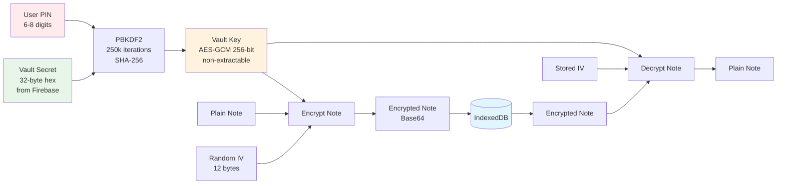

# Design Document: ScribeVault

## Overview

ScribeVault is a zero-knowledge HIPAA-compliant web application built with Next.js (Pages Router), TypeScript, Tailwind CSS, and shadcn/ui. The architecture implements a stateless backend that acts as a pure transit pipe to Groq AI APIs, while all Protected Health Information (PHI) is encrypted client-side using Web Crypto API with keys derived from user-defined PINs. The design prioritizes security through encryption, session management, and aggressive data lifecycle policies.

**Core Architectural Principles:**
- Zero-knowledge: Server never has access to unencrypted PHI
- Stateless processing: No server-side data persistence
- Client-side encryption: All PHI encrypted at rest in IndexedDB
- Session security: Aggressive timeouts and brute force protection

## Steering Document Alignment

### Technical Standards

Since no steering documents exist yet, this design establishes the following technical standards:

- **Framework**: Next.js 16.x with Pages Router (explicit requirement - NOT App Router)
- **Language**: TypeScript with strict mode enabled
- **Styling**: Tailwind CSS v4 + shadcn/ui component library
- **Authentication**: Firebase Auth (client SDK) + Firebase Admin (server SDK)
- **AI/ML**: Groq SDK for Whisper Turbo (transcription) and Llama 3.3 70B (SOAP formatting)
- **Storage**: IndexedDB via idb-keyval (lightweight wrapper)
- **Cryptography**: Web Crypto API (browser native, FIPS compliant)

### Project Structure

Following Next.js Pages Router conventions with organized module boundaries:

```
src/
├── pages/              # Next.js Pages Router
│   ├── _app.tsx        # App wrapper with providers
│   ├── _document.tsx   # Custom document
│   ├── index.tsx       # Main application
│   ├── login.tsx       # Authentication page
│   └── api/            # API routes (serverless functions)
│       ├── auth/
│       │   └── init.ts
│       └── scribe.ts
├── components/         # React UI components
├── context/            # React Context providers
├── hooks/              # Custom React hooks
├── lib/                # Library initialization and utilities
├── types/              # TypeScript type definitions
└── styles/             # Global styles
```

## Code Reuse Analysis

### Existing Components to Leverage

This is a fresh Next.js application, so we'll leverage external libraries:

- **Next.js**: Routing, API routes, SSR capabilities, build optimization
- **shadcn/ui**: Pre-built accessible components (Button, Card, Input, Dialog, Alert, Toast, Sonner)
- **Tailwind CSS**: Utility-first styling with responsive design
- **Firebase SDK**: Authentication, token management, custom claims
- **Groq SDK**: AI/ML API client for transcription and text generation
- **idb-keyval**: Simple IndexedDB wrapper (reduces boilerplate vs raw IndexedDB API)
- **Web Crypto API**: Browser-native cryptography (no external crypto library needed)

### Integration Points

- **Firebase Identity Platform**: User authentication and JWT token generation
- **Groq Cloud**: External AI API for Whisper (STT) and Llama (text generation)
- **IndexedDB**: Browser storage for encrypted notes
- **Browser APIs**: MediaRecorder, Wake Lock, Web Crypto

## Architecture

### High-Level Architecture

```mermaid
graph TB
    subgraph "Client (Browser)"
        UI[React UI Components]
        AC[AuthContext]
        VC[VaultContext]
        IDB[(IndexedDB<br/>Encrypted Notes)]
        WC[Web Crypto API]

        UI --> AC
        UI --> VC
        VC --> WC
        VC --> IDB
    end

    subgraph "Next.js API Routes"
        AuthAPI[/api/auth/init]
        ScribeAPI[/api/scribe]

        AuthAPI --> FA[Firebase Admin]
        ScribeAPI --> FA
        ScribeAPI --> Groq[Groq SDK]
    end

    subgraph "External Services"
        FB[Firebase Auth]
        GROQ[Groq Cloud APIs]
    end

    UI -->|Login/Logout| FB
    AC -->|Token Refresh| FB
    AuthAPI -->|Custom Claims| FB

    UI -->|Audio Upload| ScribeAPI
    Groq -->|Transcribe| GROQ
    Groq -->|SOAP Format| GROQ

    style IDB fill:#e1f5fe
    style WC fill:#f3e5f5
    style GROQ fill:#fff3e0
    style FB fill:#fff3e0
```

### Security Architecture



### Modular Design Principles

- **Single File Responsibility**:
  - `crypto.ts` handles only cryptographic operations
  - `storage.ts` handles only IndexedDB operations
  - `firebase-client.ts` handles only client-side Firebase init
  - `firebase-admin.ts` handles only server-side Firebase init
  - `groq.ts` handles only Groq client init

- **Component Isolation**:
  - Each UI component (PINOverlay, Recorder, NoteCard) is self-contained
  - Components receive props and callbacks, not global state directly
  - Contexts manage global state, components consume it

- **Service Layer Separation**:
  - API routes (`/api/*`) handle server-side logic
  - Hooks (`useRecorder`, `useNotes`) handle client-side business logic
  - Components handle only presentation

- **Utility Modularity**:
  - Crypto utilities are pure functions (no side effects)
  - Storage utilities abstract IndexedDB complexity
  - Constants are centralized in `constants.ts`

## Components and Interfaces

### 1. Authentication System

#### `src/lib/firebase-client.ts`
- **Purpose:** Initialize Firebase client SDK for browser authentication
- **Interfaces:**
  - `export const auth: Auth` - Firebase Auth instance
  - `export const googleProvider: GoogleAuthProvider` - Google sign-in provider
  - `export const emailPasswordProvider: EmailAuthProvider` - Email/password provider
- **Dependencies:** firebase package
- **Reuses:** Firebase SDK initialization patterns

#### `src/lib/firebase-admin.ts`
- **Purpose:** Initialize Firebase Admin SDK for server-side token verification
- **Interfaces:**
  - `export const adminAuth: Auth` - Firebase Admin Auth instance
- **Dependencies:** firebase-admin package, FIREBASE_SERVICE_ACCOUNT_JSON env var
- **Reuses:** Firebase Admin SDK patterns

#### `src/context/AuthContext.tsx`
- **Purpose:** Manage authentication state and provide auth operations to components
- **Interfaces:**
  ```typescript
  interface AuthContextValue {
    user: User | null;
    loading: boolean;
    idToken: string | null;
    vaultSecret: string | null;
    signInWithGoogle: () => Promise<void>;
    signInWithEmail: (email: string, password: string) => Promise<void>;
    signOut: () => Promise<void>;
  }
  ```
- **Dependencies:** Firebase client SDK, jwt-decode (for extracting custom claims)
- **Reuses:** React Context API, Firebase Auth state observer

#### `src/pages/api/auth/init.ts`
- **Purpose:** Initialize vault secret as Firebase custom claim on first login
- **Interfaces:**
  - POST `/api/auth/init`
  - Request: `{ idToken: string }`
  - Response: `{ status: 'ready' | 'created' }`
- **Dependencies:** Firebase Admin SDK, crypto.randomBytes
- **Reuses:** Next.js API route pattern

### 2. Encryption System

#### `src/lib/constants.ts`
- **Purpose:** Centralize all configuration constants
- **Interfaces:**
  ```typescript
  export const CRYPTO_CONFIG: {
    PBKDF2_ITERATIONS: 250000,
    KEY_LENGTH: 256,
    IV_LENGTH: 12,
    SALT_ALGORITHM: 'SHA-256',
  };

  export const SESSION_CONFIG: {
    IDLE_TIMEOUT_MS: 900000, // 15 min
    MAX_RECORDING_MS: 3600000, // 60 min
    DATA_TTL_MS: 43200000, // 12 hours
    JANITOR_INTERVAL_MS: 300000, // 5 min
    MAX_PIN_ATTEMPTS: 5,
  };

  export const PIN_CONFIG: {
    MIN_LENGTH: 6,
    MAX_LENGTH: 8,
  };
  ```
- **Dependencies:** None
- **Reuses:** TypeScript const assertions

#### `src/types/index.ts`
- **Purpose:** Define all TypeScript interfaces and types
- **Interfaces:**
  ```typescript
  export interface EncryptedNote {
    id: string;
    timestamp: number;
    iv: string; // Base64 encoded
    data: string; // Base64 encoded ciphertext
  }

  export interface DecryptedNote {
    id: string;
    timestamp: number;
    transcript: string;
    soapNote: string;
    duration: number;
  }

  export interface VaultState {
    isUnlocked: boolean;
    isFirstTime: boolean;
    pinAttemptsRemaining: number;
  }

  export type RecordingStatus = 'idle' | 'recording' | 'processing' | 'complete' | 'error';
  ```
- **Dependencies:** None
- **Reuses:** TypeScript type system

#### `src/lib/crypto.ts`
- **Purpose:** Provide cryptographic operations using Web Crypto API
- **Interfaces:**
  ```typescript
  export async function deriveVaultKey(pin: string, vaultSecret: string): Promise<CryptoKey>;
  export async function encryptData(key: CryptoKey, data: string): Promise<{ iv: string; ciphertext: string }>;
  export async function decryptData(key: CryptoKey, iv: string, ciphertext: string): Promise<string>;
  export function isValidPIN(pin: string): boolean;
  ```
- **Dependencies:** Web Crypto API (browser native)
- **Reuses:** PBKDF2 and AES-GCM algorithms (FIPS 140-2 compliant)

#### `src/lib/storage.ts`
- **Purpose:** Manage encrypted note storage in IndexedDB
- **Interfaces:**
  ```typescript
  export async function saveEncryptedNote(key: CryptoKey, note: DecryptedNote): Promise<void>;
  export async function loadAllNotes(key: CryptoKey): Promise<DecryptedNote[]>;
  export async function deleteNote(noteId: string): Promise<void>;
  export async function purgeAllData(): Promise<void>;
  export async function runJanitor(): Promise<number>;
  ```
- **Dependencies:** idb-keyval, crypto.ts
- **Reuses:** idb-keyval's get/set API

#### `src/context/VaultContext.tsx`
- **Purpose:** Manage vault key state, PIN operations, and session management
- **Interfaces:**
  ```typescript
  interface VaultContextValue {
    vaultKey: CryptoKey | null;
    isLocked: boolean;
    isFirstTimeSetup: boolean;
    pinAttemptsRemaining: number;
    recordingStatus: RecordingStatus;
    unlock: (pin: string) => Promise<boolean>;
    lock: () => void;
    setupPIN: (pin: string) => Promise<void>;
    setRecordingStatus: (status: RecordingStatus) => void;
    resetBruteForce: () => void;
  }
  ```
- **Dependencies:** AuthContext, crypto.ts, storage.ts
- **Reuses:** React Context, useEffect for idle timer and janitor

### 3. Recording System

#### `src/hooks/useRecorder.ts`
- **Purpose:** Manage audio recording using MediaRecorder API
- **Interfaces:**
  ```typescript
  interface UseRecorderReturn {
    status: RecordingStatus;
    duration: number;
    remainingTime: number;
    startRecording: () => Promise<void>;
    stopRecording: () => Promise<Blob>;
    error: string | null;
  }
  ```
- **Dependencies:** MediaRecorder API, Wake Lock API (optional)
- **Reuses:** React hooks (useState, useEffect, useRef)

#### `src/components/Recorder.tsx`
- **Purpose:** UI for audio recording with visual feedback
- **Interfaces:**
  - Props: `{ onRecordingComplete: (blob: Blob, duration: number) => void }`
- **Dependencies:** useRecorder hook, VaultContext
- **Reuses:** shadcn/ui Button, visual feedback patterns

#### `src/lib/groq.ts`
- **Purpose:** Initialize Groq SDK client
- **Interfaces:**
  ```typescript
  export const groq: Groq;
  export const SOAP_SYSTEM_PROMPT: string;
  ```
- **Dependencies:** groq-sdk package, GROQ_API_KEY env var
- **Reuses:** Groq SDK initialization

#### `src/pages/api/scribe.ts`
- **Purpose:** Proxy API for transcription and SOAP note generation
- **Interfaces:**
  - POST `/api/scribe`
  - Request: `multipart/form-data { audio: File, idToken: string }`
  - Response: `{ transcript: string, soapNote: string }`
- **Dependencies:** Firebase Admin, Groq SDK, multipart form parser
- **Reuses:** Next.js API route, Groq Whisper and Llama models

### 4. Notes Management

#### `src/hooks/useNotes.ts`
- **Purpose:** Manage notes CRUD operations
- **Interfaces:**
  ```typescript
  interface UseNotesReturn {
    notes: DecryptedNote[];
    loading: boolean;
    loadNotes: () => Promise<void>;
    saveNote: (note: DecryptedNote) => Promise<void>;
    deleteNote: (noteId: string) => Promise<void>;
    error: string | null;
  }
  ```
- **Dependencies:** VaultContext, storage.ts
- **Reuses:** React hooks

#### `src/components/NoteCard.tsx`
- **Purpose:** Display individual note with expand/collapse and actions
- **Interfaces:**
  - Props: `{ note: DecryptedNote, onDelete: (id: string) => void }`
- **Dependencies:** None (presentational component)
- **Reuses:** shadcn/ui Card, Button, Dialog

#### `src/components/NotesList.tsx`
- **Purpose:** Display list of notes
- **Interfaces:**
  - Props: `{ notes: DecryptedNote[], onDelete: (id: string) => void }`
- **Dependencies:** NoteCard component
- **Reuses:** Array mapping pattern

### 5. Session Management

#### `src/hooks/useIdleTimer.ts`
- **Purpose:** Detect user inactivity and trigger vault lock
- **Interfaces:**
  ```typescript
  interface UseIdleTimerReturn {
    timeUntilLock: number; // milliseconds
    resetTimer: () => void;
  }
  ```
- **Dependencies:** VaultContext
- **Reuses:** Event listeners (mousedown, keydown, scroll, touchstart)

#### `src/components/SessionTimer.tsx`
- **Purpose:** Display countdown to session lock
- **Interfaces:**
  - Props: `{ timeUntilLock: number }`
- **Dependencies:** useIdleTimer hook
- **Reuses:** shadcn/ui visual feedback components

### 6. PIN Management UI

#### `src/components/PINOverlay.tsx`
- **Purpose:** Full-screen PIN entry overlay for unlocking vault
- **Interfaces:**
  - Props: `{ onUnlock: (pin: string) => Promise<boolean>, attemptsRemaining: number }`
- **Dependencies:** VaultContext
- **Reuses:** shadcn/ui Input, Button, Card

#### `src/components/PINSetup.tsx`
- **Purpose:** First-time PIN creation flow
- **Interfaces:**
  - Props: `{ onSetup: (pin: string) => Promise<void> }`
- **Dependencies:** VaultContext
- **Reuses:** shadcn/ui Input, Button, Card

### 7. Layout and Pages

#### `src/components/Layout.tsx`
- **Purpose:** Main layout wrapper with header and navigation
- **Interfaces:**
  - Props: `{ children: ReactNode }`
- **Dependencies:** AuthContext
- **Reuses:** shadcn/ui layout patterns

#### `src/pages/login.tsx`
- **Purpose:** Authentication page
- **Interfaces:** Standard Next.js page
- **Dependencies:** AuthContext, Firebase client
- **Reuses:** shadcn/ui Button, Card

#### `src/pages/index.tsx`
- **Purpose:** Main application page with recorder and notes list
- **Interfaces:** Standard Next.js page
- **Dependencies:** All contexts, Recorder, NotesList
- **Reuses:** Layout component

#### `src/pages/_app.tsx`
- **Purpose:** App wrapper with providers
- **Interfaces:** Standard Next.js App component
- **Dependencies:** AuthContext, VaultContext
- **Reuses:** Next.js App component pattern

## Data Models

### EncryptedNote (IndexedDB Storage Model)
```typescript
{
  id: string;              // UUID v4
  timestamp: number;       // Unix timestamp (ms) when note was created
  iv: string;              // Base64-encoded 12-byte initialization vector
  data: string;            // Base64-encoded AES-GCM ciphertext
}
```

**Storage Format:**
- Stored in IndexedDB under key: `'clinical_notes'`
- Value is an array: `EncryptedNote[]`
- No indexes (simple key-value storage via idb-keyval)

### DecryptedNote (Application Model)
```typescript
{
  id: string;              // UUID v4 (matches EncryptedNote.id)
  timestamp: number;       // Unix timestamp (ms)
  transcript: string;      // Raw transcript from Groq Whisper
  soapNote: string;        // Formatted SOAP note from Groq Llama
  duration: number;        // Recording duration in seconds
}
```

**Serialization:**
- Serialized to JSON before encryption
- Deserialized from JSON after decryption

### VaultKey (In-Memory Only)
```typescript
CryptoKey {
  type: 'secret',
  algorithm: { name: 'AES-GCM', length: 256 },
  extractable: false,      // CRITICAL: prevents key extraction
  usages: ['encrypt', 'decrypt']
}
```

**Derivation:**
- Derived using PBKDF2 with:
  - Password: User PIN (6-8 digits, UTF-8 encoded)
  - Salt: Vault Secret (32-byte hex from Firebase custom claim, UTF-8 encoded)
  - Iterations: 250,000
  - Hash: SHA-256
  - Output: 256-bit AES-GCM key

**Lifecycle:**
- Created: On successful PIN entry (unlock or setup)
- Stored: In VaultContext state only (React state)
- Destroyed: On vault lock (set to null, garbage collected)
- Never persisted to any storage

### Firebase Custom Claims
```typescript
{
  vault_secret: string;    // 32-byte hex string (64 characters)
}
```

**Generation:**
- Created on first authentication via `/api/auth/init`
- Generated using `crypto.randomBytes(32).toString('hex')`
- Stored in Firebase as user custom claim
- Immutable (never regenerated for same user)

### API Request/Response Models

#### POST `/api/auth/init`
**Request:**
```typescript
{
  idToken: string;         // Firebase ID token
}
```

**Response:**
```typescript
{
  status: 'ready' | 'created';
}
```

#### POST `/api/scribe`
**Request (multipart/form-data):**
```typescript
{
  audio: File;             // Audio blob (audio/webm)
  idToken: string;         // Firebase ID token
}
```

**Response:**
```typescript
{
  transcript: string;      // Raw transcript
  soapNote: string;        // Formatted SOAP note
}
```

## Error Handling

### Error Scenarios

#### 1. Microphone Access Denied
- **Handling:** Catch MediaDevices.getUserMedia rejection
- **User Impact:** Display error message: "Microphone access required. Please allow in browser settings."
- **Recovery:** Show retry button that re-requests permission

#### 2. Network Error During Upload
- **Handling:** Implement retry logic with exponential backoff (3 attempts: 1s, 2s, 4s)
- **User Impact:** Display status: "Upload failed. Retrying..."
- **Recovery:** If all retries fail, show: "Upload failed. Please check your connection and try again."

#### 3. Groq API Error (Rate Limit, Service Down)
- **Handling:** Catch API errors and preserve audio blob
- **User Impact:** Display: "AI processing failed. Please try again."
- **Recovery:** Allow user to retry with same audio blob (don't require re-recording)

#### 4. Decryption Failed
- **Handling:** Catch decrypt errors on individual notes
- **User Impact:** Display warning badge on note card: "Could not decrypt note. Data may be corrupted."
- **Recovery:** Offer "Delete Corrupted Note" button

#### 5. Max PIN Attempts Exceeded
- **Handling:** After 5th failed attempt, call `purgeAllData()` and `signOut()`
- **User Impact:** Display: "Too many incorrect PIN attempts. All local data has been erased for security."
- **Recovery:** Redirect to login page, user starts fresh

#### 6. Idle Timeout
- **Handling:** Auto-lock vault after 15 minutes of inactivity (unless recording/processing)
- **User Impact:** Display PIN overlay on next interaction
- **Recovery:** User re-enters PIN to continue

#### 7. Recording Auto-Stop (60 Minutes)
- **Handling:** useEffect cleanup on duration reaching MAX_RECORDING_MS
- **User Impact:** Toast notification: "Recording reached 60-minute limit and has been stopped."
- **Recovery:** Recording proceeds to transcription automatically

#### 8. IndexedDB Quota Exceeded
- **Handling:** Catch QuotaExceededError on save
- **User Impact:** Display: "Storage full. Please delete old notes."
- **Recovery:** User deletes notes manually, or wait for 12-hour janitor cleanup

#### 9. Firebase Token Expired
- **Handling:** Refresh token on 401 responses
- **User Impact:** Brief loading indicator during refresh
- **Recovery:** Retry API call with fresh token

#### 10. Browser Not Supported
- **Handling:** Check for Web Crypto API and IndexedDB on mount
- **User Impact:** Display: "Your browser is not supported. Please use Chrome, Safari, Firefox, or Edge."
- **Recovery:** None (user must switch browser)

### Global Error Boundary
- Wrap `_app.tsx` with React Error Boundary
- Catch component rendering errors
- Display fallback UI: "Something went wrong. Please refresh the page."
- Log error to console (no PHI in error messages)

## Testing Strategy

### Unit Testing

**Framework:** Jest + React Testing Library

**Key Components to Test:**

1. **Crypto Utilities (`crypto.ts`)**
   - Test key derivation produces consistent results with same inputs
   - Test different PINs produce different keys
   - Test encryption produces unique ciphertexts (different IVs)
   - Test decryption recovers original plaintext
   - Test wrong key fails decryption
   - Test PIN validation regex

2. **Storage Utilities (`storage.ts`)**
   - Mock IndexedDB
   - Test save/load/delete operations
   - Test janitor deletes old notes
   - Test purge clears all data

3. **Hooks**
   - `useRecorder`: Test state transitions (idle → recording → processing → complete)
   - `useNotes`: Test CRUD operations
   - `useIdleTimer`: Test timer reset on activity

4. **Components**
   - `PINOverlay`: Test PIN input validation, attempts counter
   - `NoteCard`: Test expand/collapse, copy actions
   - `Recorder`: Test button states based on recording status

### Integration Testing

**Framework:** Jest + React Testing Library + MSW (Mock Service Worker)

**Key Flows to Test:**

1. **Authentication Flow**
   - Mock Firebase auth
   - Test login → `/api/auth/init` → token refresh → redirect
   - Test logout clears session

2. **Recording Flow**
   - Mock MediaRecorder API
   - Mock `/api/scribe` endpoint
   - Test record → upload → transcribe → encrypt → save
   - Test error recovery (retry logic)

3. **Vault Lock/Unlock Flow**
   - Test correct PIN unlocks vault
   - Test incorrect PIN decrements attempts
   - Test 5 failed attempts triggers purge

4. **Session Timeout Flow**
   - Mock timers
   - Test idle timeout locks vault
   - Test recording prevents idle lock

### End-to-End Testing

**Framework:** Playwright

**User Scenarios to Test:**

1. **First-Time User Journey**
   - Navigate to app → redirected to login
   - Sign in with Google
   - Create 6-digit PIN
   - Record 10-second audio
   - Verify SOAP note appears
   - Copy SOAP note
   - Delete note

2. **Returning User Journey**
   - Navigate to app → PIN overlay
   - Enter correct PIN
   - View existing notes
   - Record new note
   - Sign out

3. **Security Scenarios**
   - Enter wrong PIN 5 times → verify data purge
   - Wait 15 minutes idle → verify vault locks
   - Close browser → reopen → verify session cleared

4. **Edge Cases**
   - Record for 60 minutes → verify auto-stop
   - Lose network during upload → verify retry
   - Deny microphone access → verify error message

### Manual Testing Checklist

- [ ] Test on iOS Safari (Web Crypto API, MediaRecorder support)
- [ ] Test on Android Chrome (MediaRecorder codecs)
- [ ] Test on desktop browsers (Chrome, Firefox, Edge, Safari)
- [ ] Test with VoiceOver (iOS) for accessibility
- [ ] Test with screen reader (NVDA/JAWS) for accessibility
- [ ] Test offline mode (recording should work, upload should queue)
- [ ] Test low storage scenario (IndexedDB quota)
- [ ] Verify no PHI in browser DevTools console
- [ ] Verify no PHI in Network tab (check request/response headers)
- [ ] Test 12-hour janitor (mock timestamps)

## Performance Considerations

### Client-Side Performance

1. **Key Derivation Latency**
   - PBKDF2 with 250k iterations takes 100-500ms
   - Display loading spinner during unlock
   - Consider Web Workers for non-blocking execution (future optimization)

2. **Encryption/Decryption Throughput**
   - AES-GCM is fast (~10MB/s in browser)
   - SOAP notes are small (<10KB typically)
   - Encryption overhead negligible

3. **IndexedDB Performance**
   - idb-keyval is async (non-blocking)
   - Reading 100 notes takes ~50ms
   - Use pagination if note count exceeds 1000 (unlikely given 12-hour TTL)

4. **Audio Recording**
   - MediaRecorder uses hardware encoding (efficient)
   - 60-minute recording at 128kbps ≈ 60MB
   - Blob creation is instant (no processing)

### Network Performance

1. **Audio Upload Size**
   - 10-minute recording ≈ 10MB
   - 60-minute recording ≈ 60MB
   - Use compression if needed (Opus codec already efficient)

2. **Groq API Latency**
   - Whisper Turbo: ~5-10 seconds for 10-minute audio
   - Llama 3.3 70B: ~3-5 seconds for 2000 tokens
   - Total: ~10-15 seconds for full pipeline

3. **Retry Strategy**
   - Exponential backoff: 1s, 2s, 4s (3 attempts max)
   - Timeout: 60 seconds per attempt

### Optimization Strategies

- **Lazy Load**: Load shadcn/ui components dynamically (Next.js automatic code splitting)
- **Memoization**: Use React.memo for NoteCard components (prevent re-renders)
- **Virtual Scrolling**: If note count > 100, implement virtual list (future optimization)
- **Service Worker**: Cache app shell for offline support (future enhancement)

## Security Considerations

### Client-Side Security

1. **Key Management**
   - Vault key stored only in React state (volatile memory)
   - Non-extractable flag prevents key export
   - Key destroyed on vault lock (garbage collected)

2. **PIN Security**
   - PIN never stored (exists only as function parameter)
   - Brute force protection (5 attempts max)
   - Rate limiting via attempt counter

3. **Data Encryption**
   - AES-GCM authenticated encryption (prevents tampering)
   - Unique IV per encryption (prevents pattern analysis)
   - Strong key derivation (PBKDF2 250k iterations)

4. **Session Security**
   - browserSessionPersistence (token cleared on browser close)
   - Idle timeout (15 minutes)
   - Max recording time (60 minutes)

### Server-Side Security

1. **Token Verification**
   - All API routes verify Firebase JWT
   - Invalid tokens return 401 immediately
   - No processing without valid authentication

2. **Stateless Processing**
   - Audio and transcripts never written to disk
   - Data exists only in function memory during request
   - Memory cleared on function completion (serverless)

3. **Logging Restrictions**
   - Never log PHI (transcripts, notes, patient data)
   - Log only: user ID, timestamp, error type
   - Production logs audited for compliance

4. **HTTPS Enforcement**
   - All traffic over TLS 1.3
   - Strict-Transport-Security header
   - Content-Security-Policy header

### Compliance Measures

1. **HIPAA BAA**
   - Human signs BAAs with Firebase and Groq
   - Document BAA signatures in compliance folder

2. **Safe Harbor**
   - Device theft → encrypted data useless without PIN
   - Cloud compromise → no PHI stored on servers
   - Account takeover → data encrypted with user-specific vault secret

3. **Audit Trail**
   - Log authentication events (user ID, timestamp)
   - Log API calls (user ID, endpoint, timestamp, error code)
   - Never log PHI content

## Deployment Architecture

### Next.js Build Configuration

```javascript
// next.config.js
module.exports = {
  output: 'standalone',
  reactStrictMode: true,
  compress: true,
  poweredByHeader: false,

  // Security headers
  async headers() {
    return [
      {
        source: '/:path*',
        headers: [
          {
            key: 'X-Frame-Options',
            value: 'DENY',
          },
          {
            key: 'X-Content-Type-Options',
            value: 'nosniff',
          },
          {
            key: 'Strict-Transport-Security',
            value: 'max-age=31536000; includeSubDomains',
          },
          {
            key: 'Content-Security-Policy',
            value: "default-src 'self'; script-src 'self' 'unsafe-eval' 'unsafe-inline'; style-src 'self' 'unsafe-inline'; img-src 'self' data: https:; connect-src 'self' https://identitytoolkit.googleapis.com https://securetoken.googleapis.com https://api.groq.com;",
          },
        ],
      },
    ];
  },
};
```

### Docker Configuration

```dockerfile
FROM node:20-alpine AS builder
WORKDIR /app
COPY package*.json ./
RUN npm ci
COPY . .
RUN npm run build

FROM node:20-alpine AS runner
WORKDIR /app
ENV NODE_ENV=production
COPY --from=builder /app/.next/standalone ./
COPY --from=builder /app/.next/static ./.next/static
COPY --from=builder /app/public ./public
EXPOSE 3000
CMD ["node", "server.js"]
```

### Environment Variables (Production)

- `NEXT_PUBLIC_FIREBASE_*`: Client-side Firebase config (public)
- `FIREBASE_SERVICE_ACCOUNT_JSON`: Server-side Firebase credentials (secret)
- `GROQ_API_KEY`: Groq API key (secret)
- `NODE_ENV=production`: Enable production optimizations

### Monitoring and Alerts

- **Error Tracking**: Sentry (configure to exclude PHI from error reports)
- **Performance Monitoring**: Next.js analytics
- **Uptime Monitoring**: Pingdom or similar
- **Log Aggregation**: Google Cloud Logging (with PHI filters)

## Migration and Rollout Strategy

Since this is a new application:

1. **Development Phase**
   - Local development with `.env.local`
   - Test with Firebase emulator and mock Groq API

2. **Staging Phase**
   - Deploy to staging environment
   - Test with real Firebase (staging project) and Groq (dev tier)
   - Conduct security audit and penetration testing

3. **Production Rollout**
   - Deploy to production (Cloud Run)
   - Pilot with 5-10 trusted users
   - Collect feedback and iterate
   - Gradual rollout to full user base

4. **Post-Launch**
   - Monitor error rates and performance metrics
   - Collect user feedback on UX
   - Iterate on features (WebAuthn, voice commands, etc.)
